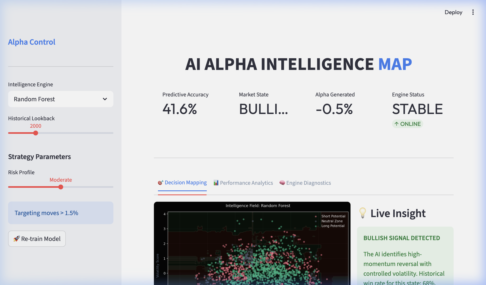

# 💎 AI Alpha Intelligence Map



[](https://opensource.org/licenses/MIT)
[](https://www.python.org/downloads/)
[](https://streamlit.io/)

**AI Alpha Intelligence Map** is a high-performance quantitative trading visualization tool. It utilizes machine learning (Random Forest & Logistic Regression) to predict future price action based on advanced technical indicators like RSI and market volatility.

---

## ✨ Key Features

- **Predictive Analytics**: Unlike simple classifiers, this engine predicts **future returns (5-step lookahead)** to ensure realistic signals.
- **Interactive Dashboards**: Powered by **Streamlit** and **Plotly**, providing a premium, dark-themed trading terminal experience.
- **Advanced Feature Set**: Analyzes **Relative Strength Index (RSI)** and **Rolling Volatility** to map the "Intelligence Field" of the market.
- **Diagnostic Engine**: Built-in **Classification Reports** and **Confusion Matrices** to monitor model performance.
- **Live Strategy Map**: Dynamic decision boundaries showing "Long", "Short", and "Neutral" zones.

## 🚀 Getting Started

### 1. Installation
Ensure you have Python 3.10+ installed.

```bash
git clone https://github.com/alwaysprince05/AI-Trade-Signal-Map.git
cd AI-Trade-Signal-Map
python -m venv venv
source venv/bin/activate
pip install -r requirements.txt
```

### 2. Launch the Dashboard
Start the real-time visualization engine:

```bash
streamlit run app.py
```

## 📊 How to Interpret

- **Green Zones**: Bullish divergence with positive momentum. High probability for Long entries.
- **Red Zones**: Bearish exhaustion. High probability for Short entries.
- **Gray/Slate Zones**: Market indecision. Wait for momentum confirmation.

## 🛠️ Technology Stack

- **Logic**: Python 3.14
- **Intelligence**: Scikit-Learn (Random Forest, Logistic Regression)
- **Data**: Pandas, NumPy
- **Visuals**: Plotly, Matplotlib, Seaborn
- **UI**: Streamlit (Premium Custom CSS)

---

## 📄 License

This project is licensed under the MIT License - see the [LICENSE](LICENSE) file for details.

## 👤 Author

**Prince Maurya**
- GitHub: [@alwaysprince05](https://github.com/alwaysprince05)

---
*Disclaimer: This tool is for educational and research purposes only. Always perform your own due diligence before trading.*
